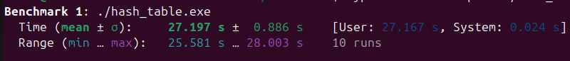
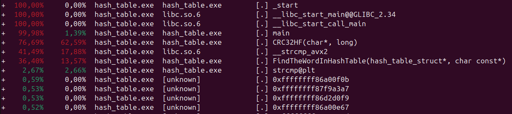
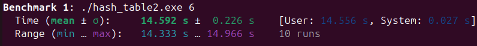
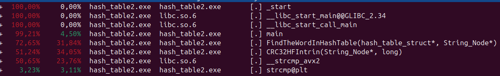
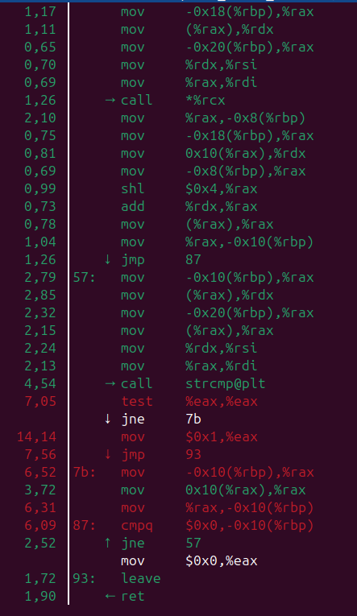
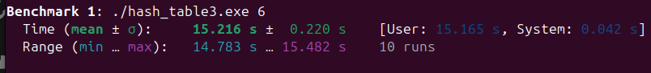
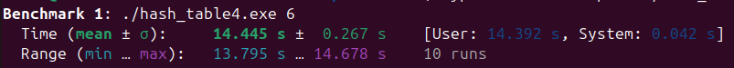
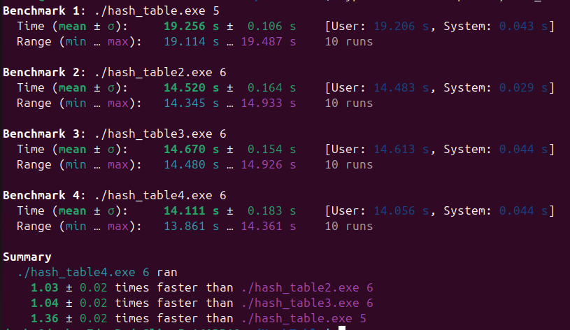
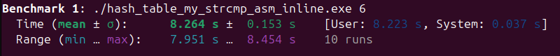

# ***HashTable***

## Filling in the table
In this project, I created a hash table that can be filled using 5 different types of hash functions:

1. Always returning 0
2. ASCII code of the first character of the word
3. Word length
4. The sum of the ASCII codes of the characters included in the word
5. Rol hash function
6. CRC32 hash function

## Comparative histograms of distributions

Let's compare the results of various hash functions for filling in a hash table.

-------------------------------------------------------------------------
### 0
**Hash Function      :** ZeroHF \
**Hash Table Capacity:** 4001   \
**Total Words        :** 6903   \
**Variance           :** 11907.424144 
### Hash Histogram


-------------------------------------------------------------------------
### 1
**Hash Function      :** FirstAlphaHF  \
**Hash Table Capacity:** 4001 \
**Total Words        :** 6903 \
**Variance           :** 493.065734 
### Hash Histogram


-------------------------------------------------------------------------
### 2
**Hash Function      :** WordLengthHF  \
**Hash Table Capacity:** 4001 \
**Total Words        :** 6903 \
**Variance           :** 1496.786803 
### Hash Histogram


-------------------------------------------------------------------------
### 3
**Hash Function      :** ASCIIHF  \
**Hash Table Capacity:** 4001 \
**Total Words        :** 6903 \
**Variance           :** 20.088978
### Hash Histogram


-------------------------------------------------------------------------
### 4
**Hash Function      :** RolHF  \
**Hash Table Capacity:** 4001 \
**Total Words        :** 6903 \
**Variance           :** 2.151962
### Hash Histogram


-------------------------------------------------------------------------
### 5
**Hash Function      :** CRC32HF \ 
**Hash Table Capacity:** 4001 \
**Total Words        :** 6903 \
**Variance           :** 2.222444
### Hash Histogram


-------------------------------------------------------------------------

>Based on the results of the variance comparison, we find that **RolHF** and **CRC32HF** are the undisputed leaders, providing the most uniform distributions.

## And why do we need to know about word distributions and compare them?

-> The answer is obvious: to find the right word as soon as possible! But is it being searched for so quickly, even in high-end functions? 

It turns out that the search takes a lot of time if we need to find a large number of words or make sure they are missing. 

THEREFORE, WE ARE FACED WITH

## TASK: optimizing the code in order to find words in the hash table faster.

So, let's apply the following 3 optimizations inside the word search function:

* Assembler insertion
* Introductions
* Linking C code with assembly language 

(**1** ) We will compare the program execution time using the command-line benchmarking tool *hyperfine* and separately the search function using the intranet *_rdtsc()*. \
(**2**) With further optimizations, we will work with the CRC32 hash function.
(**3** ) We are launching the program with optimization -O3.
(**4** ) To identify the slowest functions, we will profile the program using the *perf* tool.
(**5** ) We are processing a text with a volume of 1026,432 words.

---------------------------------------------------
### -> First version <-

* Result of the *_rdtsc()* function: **83665594208** clock cycles 

* And here's what hyperfine showed*:



* *Perf* produced the following results: 




So, we optimize the CRC32 hash function.

### -> Second version with ⚡ CRC32Intrin ⚡ <-

We replace the CRC32 function written in C using a table with the CRC32Intrin function written using system intrenches.
In addition, we will modify the program code as a whole, creating a structure for each word from the file containing a pointer to the word and its length. We will also improve the locality of our program by allocating a large memory buffer for nodes initially. 

* Result of the *_rdtsc()* function: **75623401696** clock cycles 

* Indications *hyperfine*: 



* *Perf* produced the following results: 




As you can see, the function has moved down from the leading position to the line below.

Now let's look into our function and find the main "brake" in it.



We see the goal - to optimize strcmp.

### -> Third version with ⚡ my_strcmp ⚡ <-
Here we used the 3rd optimization, linking the C code with the assembler code.

* Result of the *_rdtsc()* function: **48167317536** clock cycles 
47678084608
* Indications *hyperfine*: 



> Unfortunately, *hyperfine* measures the running time of the entire program, and since we modified the program by adding a function to align words from the text in the buffer**, it makes a significant contribution to the total program execution time, because there are more than 10 words in the text<sup>6</sup>. But as we can see, <u>the execution time has hardly changed</u>! And all thanks to the optimization of strcmp()! 

### -> Fourth version with ⚡ inline assembly ⚡<-

Since it is important for us to show the ability to use all 3 types of optimization, we still have an unused **assembler insert**. Let's apply it to the word search function by adding a comparison of word lengths before calling our my_strcmp() function, because it's not for nothing that we have structures for each word! The compiler would not have guessed before such an optimization, so here we outsmarted it (° ʖ °). 

* Result of the *_rdtsc()* function: **46875359744** clock cycles 

> We are seeing another acceleration of the search function, which is good news! After all, this means that <u>each of the optimizations was not in vain</u>!

* Indications *hyperfine*: 



> And this is not just progress - now our program works <u>faster than the second version</u>, even despite the addition of a function to create an aligned buffer!

--------------------------------------
## **SUMMARIZING THE RESULTS**

|VERSION №|ADDED OPTIMIZATION|CPU CYCLES|
|-:|:-:|:-:|
1|-|83665594208
|2|CRC32Intrin|75623401696
|3|my_strcmp|48167317536
|4|inline assembly for length comparison|46875359744



 Of course, in the process, we optimized the program as a whole, adding something new to it in order to improve locality and add new features for targeted optimizations. Nevertheless, the acceleration is consistent from version to version, which really pleases us! (^ヮ^) 

## BUT...

In fact, there is another absolute leader, the version of the program that uses only 2 types of optimizations: CRC32Intrin + a single strcmp inline, without a separate "jump" into the assembly code.

For her, the results are even more impressive.:

* Result of the *_rdtsc()* function: **26608015872** clock cycles => is more than 3 times faster than the 1st version of the program!

* Indications *hyperfine*: 



### This version gives an acceleration of more than 3 times compared to the initial version of the program! 🏎️

## Running the program

To start the program, type
``
./hash_table\<version>.exe <number_of_hf>
``
, where 
- version (1-4) - program version
- number_of_hf (0 - 5 in version 1 and 0 - 6 in subsequent versions)   - the sequence number of the hash function (shown above, 6 - CRC32Intrin)

For example, let's run version 4 of the program using the CRC32Intrin hash function:
```
$./hash_table4.exe 6
```
To launch the "absolute leader", use the name of the executive file
`
hash_table_my_strcmp_asm_inline.exe
` with the corresponding sequence number of the function.

### 🚀 The goal has been achieved! 
Not only have we demonstrated the ability to use all three types of optimizations in our code, but we have actually accelerated our program!
