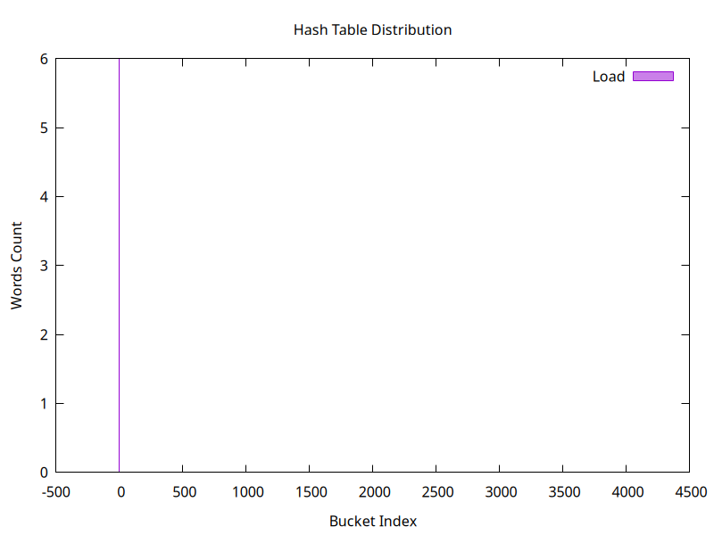
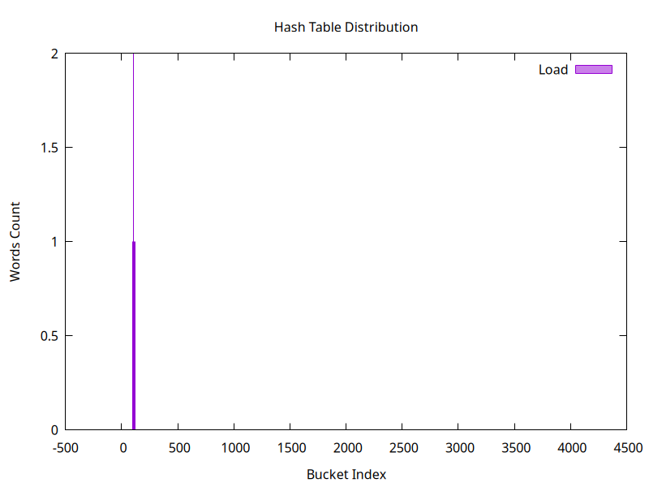
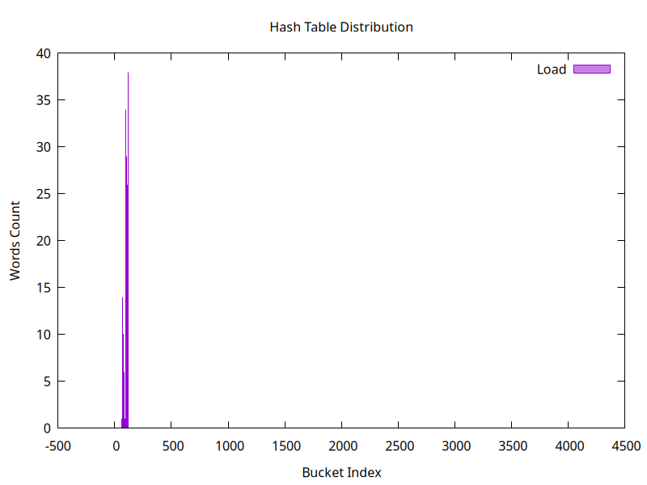
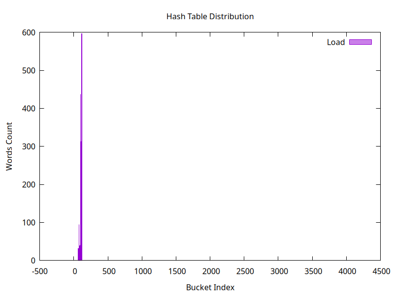
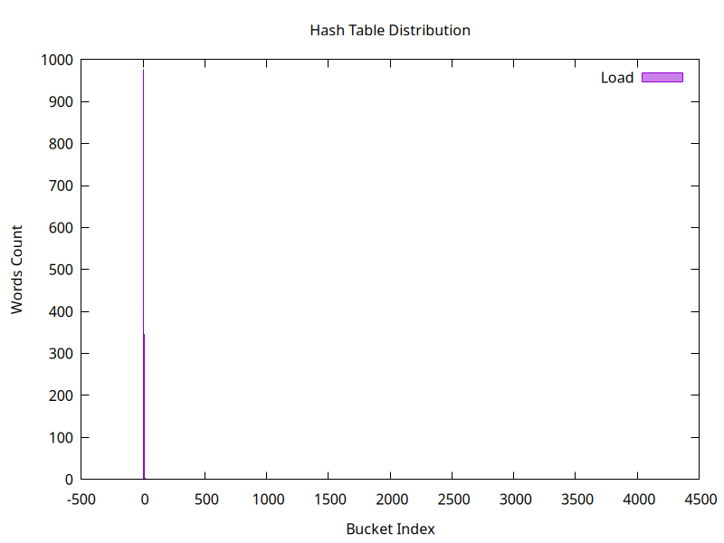
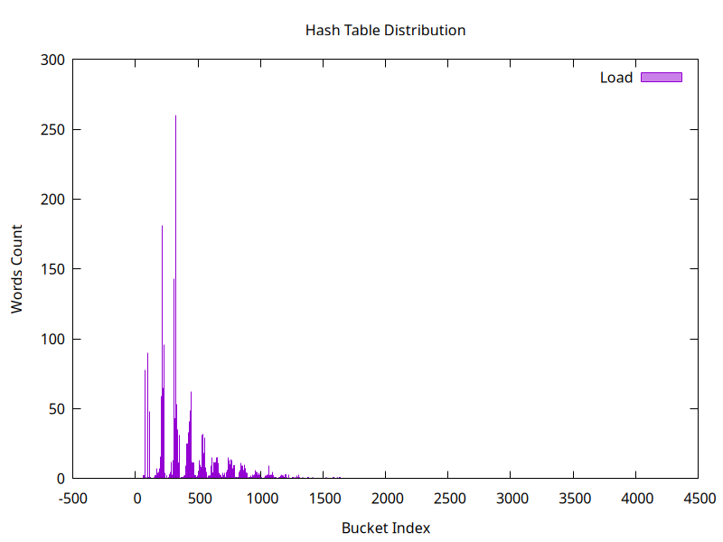
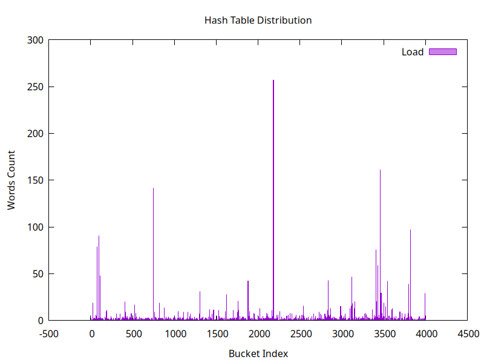
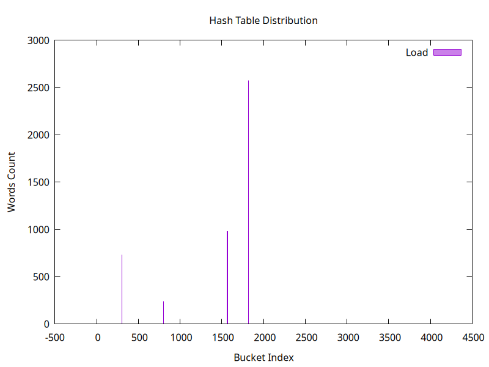
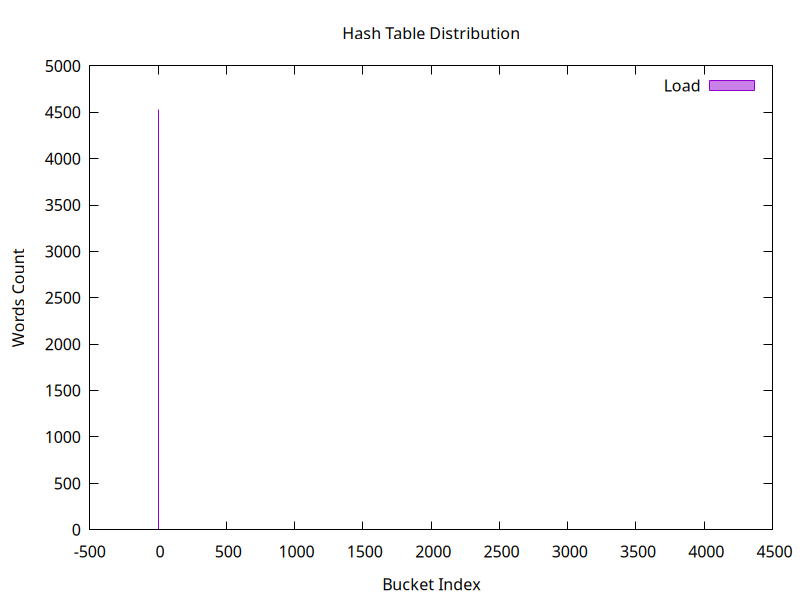

## RESULTS

**Hash Function      :** ZeroHF 
**Hash Table Capacity:** 4001
**Total Words        :** 6
**Variance           :** 0.008998
### Hash Histogram

-------------------------------------------------------------------------

## RESULTS

**Hash Function      :** ZeroHF 
**Hash Table Capacity:** 4001
**Total Words        :** 6
**Variance           :** 0.008998
### Hash Histogram

-------------------------------------------------------------------------

## RESULTS

**Hash Function      :** ZeroHF 
**Hash Table Capacity:** 4001
**Total Words        :** 6
**Variance           :** 0.008998
### Hash Histogram

-------------------------------------------------------------------------

## RESULTS

**Hash Function      :** ZeroHF 
**Hash Table Capacity:** 4001
**Total Words        :** 5
**Variance           :** 0.006248
### Hash Histogram

-------------------------------------------------------------------------

## RESULTS

**Hash Function      :** ZeroHF 
**Hash Table Capacity:** 4001
**Total Words        :** 6
**Variance           :** 0.008998
### Hash Histogram

-------------------------------------------------------------------------

## RESULTS

**Hash Function      :** ZeroHF 
**Hash Table Capacity:** 4001
**Total Words        :** 5
**Variance           :** 0.006248
### Hash Histogram

-------------------------------------------------------------------------

## RESULTS

**Hash Function      :** FirstAlphaHF 
**Hash Table Capacity:** 4001
**Total Words        :** 5
**Variance           :** 0.001750
### Hash Histogram

-------------------------------------------------------------------------

## RESULTS

**Hash Function      :** FirstAlphaHF 
**Hash Table Capacity:** 4001
**Total Words        :** 331
**Variance           :** 1.728318
### Hash Histogram

-------------------------------------------------------------------------

## RESULTS

**Hash Function      :** FirstAlphaHF 
**Hash Table Capacity:** 4001
**Total Words        :** 4525
**Variance           :** 295.120220
### Hash Histogram

-------------------------------------------------------------------------

## RESULTS

**Hash Function      :** WordLengthHF 
**Hash Table Capacity:** 4001
**Total Words        :** 4525
**Variance           :** 694.119470
### Hash Histogram

-------------------------------------------------------------------------

## RESULTS

**Hash Function      :** ASCIIHF 
**Hash Table Capacity:** 4001
**Total Words        :** 4525
**Variance           :** 51.930017
### Hash Histogram

-------------------------------------------------------------------------

## RESULTS

**Hash Function      :** RolHF 
**Hash Table Capacity:** 4001
**Total Words        :** 4525
**Variance           :** 43.210197
### Hash Histogram

-------------------------------------------------------------------------

## RESULTS

**Hash Function      :** CRC32HF 
**Hash Table Capacity:** 4001
**Total Words        :** 4525
**Variance           :** 2044.405399
### Hash Histogram

-------------------------------------------------------------------------

## RESULTS

**Hash Function      :** ZeroHF 
**Hash Table Capacity:** 4001
**Total Words        :** 4525
**Variance           :** 5116.364909
### Hash Histogram

-------------------------------------------------------------------------

## RESULTS

**Hash Function      :** ZeroHF 
**Hash Table Capacity:** 4001
**Total Words        :** 4525
**Variance           :** 5116.364909
### Hash Histogram

-------------------------------------------------------------------------

## RESULTS

**Hash Function      :** ZeroHF 
**Hash Table Capacity:** 4001
**Total Words        :** 4525
**Variance           :** 5116.364909
### Hash Histogram

-------------------------------------------------------------------------

## RESULTS

**Hash Function      :** ZeroHF 
**Hash Table Capacity:** 4001
**Total Words        :** 4525
**Variance           :** 5116.364909
### Hash Histogram

-------------------------------------------------------------------------

## RESULTS

**Hash Function      :** ZeroHF 
**Hash Table Capacity:** 4001
**Total Words        :** 4525
**Variance           :** 5116.364909
### Hash Histogram

-------------------------------------------------------------------------

## RESULTS

**Hash Function      :** ZeroHF 
**Hash Table Capacity:** 4001
**Total Words        :** 4525
**Variance           :** 5116.364909
### Hash Histogram

-------------------------------------------------------------------------

## RESULTS

**Hash Function      :** ZeroHF 
**Hash Table Capacity:** 4001
**Total Words        :** 4525
**Variance           :** 5116.364909
### Hash Histogram

-------------------------------------------------------------------------

## RESULTS

**Hash Function      :** ZeroHF 
**Hash Table Capacity:** 4001
**Total Words        :** 4525
**Variance           :** 5116.364909
### Hash Histogram

-------------------------------------------------------------------------

## RESULTS

**Hash Function      :** ZeroHF 
**Hash Table Capacity:** 4001
**Total Words        :** 4525
**Variance           :** 5116.364909
### Hash Histogram

-------------------------------------------------------------------------

## RESULTS

**Hash Function      :** ZeroHF 
**Hash Table Capacity:** 4001
**Total Words        :** 4525
**Variance           :** 5116.364909
### Hash Histogram

-------------------------------------------------------------------------

## RESULTS

**Hash Function      :** ZeroHF 
**Hash Table Capacity:** 4001
**Total Words        :** 4525
**Variance           :** 5116.364909
### Hash Histogram

-------------------------------------------------------------------------

## RESULTS

**Hash Function      :** ZeroHF 
**Hash Table Capacity:** 4001
**Total Words        :** 4525
**Variance           :** 5116.364909
### Hash Histogram

-------------------------------------------------------------------------

## RESULTS

**Hash Function      :** ZeroHF 
**Hash Table Capacity:** 4001
**Total Words        :** 4525
**Variance           :** 5116.364909
### Hash Histogram

-------------------------------------------------------------------------

## RESULTS

**Hash Function      :** ZeroHF 
**Hash Table Capacity:** 4001
**Total Words        :** 4525
**Variance           :** 5116.364909
### Hash Histogram

-------------------------------------------------------------------------

## RESULTS

**Hash Function      :** ZeroHF 
**Hash Table Capacity:** 4001
**Total Words        :** 4525
**Variance           :** 5116.364909
### Hash Histogram

-------------------------------------------------------------------------

## RESULTS

**Hash Function      :** ZeroHF 
**Hash Table Capacity:** 4001
**Total Words        :** 4525
**Variance           :** 5116.364909
### Hash Histogram

-------------------------------------------------------------------------

## RESULTS

**Hash Function      :** ZeroHF 
**Hash Table Capacity:** 4001
**Total Words        :** 4525
**Variance           :** 5116.364909
### Hash Histogram

-------------------------------------------------------------------------

## RESULTS

**Hash Function      :** ZeroHF 
**Hash Table Capacity:** 4001
**Total Words        :** 4525
**Variance           :** 5116.364909
### Hash Histogram

-------------------------------------------------------------------------

## RESULTS

**Hash Function      :** ZeroHF 
**Hash Table Capacity:** 4001
**Total Words        :** 4525
**Variance           :** 5116.364909
### Hash Histogram

-------------------------------------------------------------------------

## RESULTS

**Hash Function      :** ZeroHF 
**Hash Table Capacity:** 4001
**Total Words        :** 4525
**Variance           :** 5116.364909
### Hash Histogram

-------------------------------------------------------------------------

## RESULTS

**Hash Function      :** ZeroHF 
**Hash Table Capacity:** 4001
**Total Words        :** 4525
**Variance           :** 5116.364909
### Hash Histogram

-------------------------------------------------------------------------

## RESULTS

**Hash Function      :** ZeroHF 
**Hash Table Capacity:** 4001
**Total Words        :** 4525
**Variance           :** 5116.364909
### Hash Histogram

-------------------------------------------------------------------------

## RESULTS

**Hash Function      :** ZeroHF 
**Hash Table Capacity:** 4001
**Total Words        :** 4525
**Variance           :** 5116.364909
### Hash Histogram

-------------------------------------------------------------------------

## RESULTS

**Hash Function      :** ZeroHF 
**Hash Table Capacity:** 4001
**Total Words        :** 4525
**Variance           :** 5116.364909
### Hash Histogram

-------------------------------------------------------------------------

## RESULTS

**Hash Function      :** ZeroHF 
**Hash Table Capacity:** 4001
**Total Words        :** 4525
**Variance           :** 5116.364909
### Hash Histogram

-------------------------------------------------------------------------

## RESULTS

**Hash Function      :** ZeroHF 
**Hash Table Capacity:** 4001
**Total Words        :** 4525
**Variance           :** 5116.364909
### Hash Histogram

-------------------------------------------------------------------------

## RESULTS

**Hash Function      :** ZeroHF 
**Hash Table Capacity:** 4001
**Total Words        :** 4525
**Variance           :** 5116.364909
### Hash Histogram

-------------------------------------------------------------------------

## RESULTS

**Hash Function      :** ZeroHF 
**Hash Table Capacity:** 4001
**Total Words        :** 4525
**Variance           :** 5116.364909
### Hash Histogram

-------------------------------------------------------------------------

## RESULTS

**Hash Function      :** ZeroHF 
**Hash Table Capacity:** 4001
**Total Words        :** 4525
**Variance           :** 5116.364909
### Hash Histogram

-------------------------------------------------------------------------

## RESULTS

**Hash Function      :** ZeroHF 
**Hash Table Capacity:** 4001
**Total Words        :** 4525
**Variance           :** 5116.364909
### Hash Histogram

-------------------------------------------------------------------------

## RESULTS

**Hash Function      :** ZeroHF 
**Hash Table Capacity:** 4001
**Total Words        :** 4525
**Variance           :** 5116.364909
### Hash Histogram

-------------------------------------------------------------------------

## RESULTS

**Hash Function      :** ZeroHF 
**Hash Table Capacity:** 4001
**Total Words        :** 4525
**Variance           :** 5116.364909
### Hash Histogram

-------------------------------------------------------------------------

## RESULTS

**Hash Function      :** ZeroHF 
**Hash Table Capacity:** 4001
**Total Words        :** 4525
**Variance           :** 5116.364909
### Hash Histogram

-------------------------------------------------------------------------

## RESULTS

**Hash Function      :** ZeroHF 
**Hash Table Capacity:** 4001
**Total Words        :** 4525
**Variance           :** 5116.364909
### Hash Histogram

-------------------------------------------------------------------------

## RESULTS

**Hash Function      :** ZeroHF 
**Hash Table Capacity:** 4001
**Total Words        :** 4525
**Variance           :** 5116.364909
### Hash Histogram

-------------------------------------------------------------------------

## RESULTS

**Hash Function      :** ZeroHF 
**Hash Table Capacity:** 4001
**Total Words        :** 4525
**Variance           :** 5116.364909
### Hash Histogram

-------------------------------------------------------------------------

## RESULTS

**Hash Function      :** ZeroHF 
**Hash Table Capacity:** 4001
**Total Words        :** 4525
**Variance           :** 5116.364909
### Hash Histogram

-------------------------------------------------------------------------

## RESULTS

**Hash Function      :** ZeroHF 
**Hash Table Capacity:** 4001
**Total Words        :** 4525
**Variance           :** 5116.364909
### Hash Histogram

-------------------------------------------------------------------------

## RESULTS

**Hash Function      :** RolHF 
**Hash Table Capacity:** 4001
**Total Words        :** 28272
**Variance           :** 977.868283
### Hash Histogram

-------------------------------------------------------------------------

## RESULTS

**Hash Function      :** RolHF 
**Hash Table Capacity:** 4001
**Total Words        :** 28272
**Variance           :** 977.868283
### Hash Histogram

-------------------------------------------------------------------------

## RESULTS

**Hash Function      :** CRC32 
**Hash Table Capacity:** 4001
**Total Words        :** 28272
**Variance           :** 87295.141965
### Hash Histogram

-------------------------------------------------------------------------

## RESULTS

**Hash Function      :** CRC32HF 
**Hash Table Capacity:** 4001
**Total Words        :** 1026432
**Variance           :** 1283830.418395
### Hash Histogram

-------------------------------------------------------------------------

## RESULTS

**Hash Function      :** CRC32HF 
**Hash Table Capacity:** 4001
**Total Words        :** 1026432
**Variance           :** 1283830.418395
### Hash Histogram

-------------------------------------------------------------------------

## RESULTS

**Hash Function      :** RolHF 
**Hash Table Capacity:** 4001
**Total Words        :** 1026432
**Variance           :** 1286838.330417
### Hash Histogram

-------------------------------------------------------------------------

